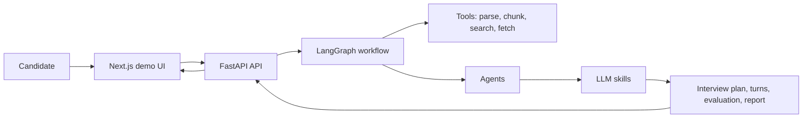

# AI Agent Interview Assistant

An agentic technical interview coach for SWE, frontend, backend, and AI agent
roles. The MVP takes a resume, job description, company name, and interview mode,
then prepares a personalized technical mock interview plan, runs interview turns,
evaluates answers, and generates a feedback report.

The current implementation is intentionally small but end-to-end: Python/FastAPI
for the backend, LangGraph for workflow orchestration, LangChain adapters for
tool wrapping, OpenAI chat models for LLM skills, and Next.js for the demo UI.

## MVP Status

- Upload a resume document through the API or UI.
- Parse and chunk local documents.
- Extract resume profile with an LLM skill.
- Analyze a job description.
- Match candidate experience to the role.
- Collect mock company and interview intelligence.
- Generate a structured interview plan.
- Submit interview answers and receive follow-up questions.
- Evaluate answers and generate a session report.
- Run a minimal Next.js dashboard against the FastAPI API.

## Architecture

- `backend/app/domain`: shared dataclasses and business vocabulary.
- `backend/app/tools`: deterministic tools such as document parsing, chunking,
  mock search, and LangChain StructuredTool adapters.
- `backend/app/skills`: LLM-powered task units, such as resume extraction,
  JD analysis, interview planning, live follow-up, evaluation, and report
  generation.
- `backend/app/agents`: thin orchestration wrappers that bind one skill to one
  responsibility.
- `backend/app/graph`: LangGraph workflow wiring for the preparation and live
  interview pipeline.
- `backend/app/api`: FastAPI routes and request/response schemas.
- `frontend/src/app`: the minimal demo workspace.
- `frontend/src/lib/api`: typed API client and frontend contracts.
- `docs`: architecture notes and interview talking points.



## Run Locally

Backend environment:

```bash
cd backend
cp .env.example .env
```

Fill in `OPENAI_API_KEY` in `backend/.env`.

Run the backend:

```bash
cd backend
python3 -m pip install -e .
python3 -m uvicorn app.api.main:app --host 127.0.0.1 --port 8000
```

Run the frontend:

```bash
cd frontend
npm install
npm run dev -- --hostname 127.0.0.1 --port 3000
```

Open:

```text
http://127.0.0.1:3000
```

The frontend defaults to `http://localhost:8000`. To override it, set:

```bash
NEXT_PUBLIC_API_BASE=http://127.0.0.1:8000
```

## Demo Scripts

Run the preparation graph:

```bash
cd backend
python3 scripts/demo_preparation_graph.py
```

Run the full backend flow:

```bash
cd backend
python3 scripts/demo_end_to_end.py
```

## Interview Talking Points

- The system separates `tool`, `skill`, `agent`, and `graph` so deterministic
  capabilities, LLM reasoning, role responsibility, and workflow orchestration
  can evolve independently.
- LangGraph is used for stateful multi-step orchestration instead of hiding the
  whole flow in one prompt.
- LangChain StructuredTool adapters wrap business tools at the boundary, so
  core business logic stays framework-neutral.
- FastAPI exposes the graph as a product API, which makes the backend usable by
  scripts, tests, and the Next.js frontend.
- External research is feature-flagged because scraping and public web search
  are less reliable than local resume/JD processing and need source-quality
  controls before becoming the default.
